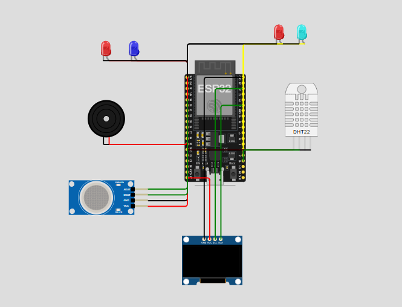

# 🏭 Medidor Inteligente de Qualidade do Ar – Projeto Luciano

Sistema de monitoramento ambiental desenvolvido com **ESP32**, integrando sensores de **temperatura**, **umidade** e **gases inflamáveis**, além de sistema de alerta visual, sonoro e mecânico. O projeto foi inteiramente simulado no **Wokwi** e envia dados em tempo real via **MQTT**, permitindo aplicações em IoT e automação residencial.

---

## 📷 Protótipo

> *Simulação feita no [Wokwi](https://wokwi.com/).*



---

## 🔎 Visão Geral

Este projeto monitora continuamente:

* 🌡️ **Temperatura** (DHT22)
* 💧 **Umidade** (DHT22)
* 🧪 **Níveis de gases inflamáveis/fumaça** (MQ-2)
* 🚨 **Alertas com LEDs**
* 🔊 **Alerta sonoro com buzzer**
* 🔧 **Servo motor** simulando o acionamento de um umidificador/sistema de cuidado do ambiente

As leituras são exibidas em um display **OLED 128×64** e publicadas em tópicos **MQTT** para monitoramento remoto.

---

## 🛠️ Funcionalidades

* Leitura de **temperatura** e **umidade** via sensor **DHT22**
* Leitura do nível de gás/fumaça com **MQ-2** (entrada analógica)
* Exibição das medições e estados no **OLED SSD1306 (I²C)**
* LEDs dedicados para indicar:

  * Temperatura baixa / alta
  * Umidade baixa / alta
* Buzzer ativado quando há qualquer condição crítica (temperatura, umidade ou gás)
* **Servo motor** acionado quando a **temperatura está alta**, simulando o funcionamento de um sistema de resfriamento/umidificação
* Envio de dados para um **broker MQTT público**
* Reconexão automática ao **Wi-Fi** e ao **servidor MQTT**

---

## ⚙️ Limites de Operação

### 🌡️ Temperatura (DHT22)

```cpp
float tempMin = 16.0;
float tempMax = 30.0;
```

| Estado    | Faixa       |
| --------- | ----------- |
| 🔵 Baixa  | ≤ 16°C      |
| 🟢 Normal | 16°C – 30°C |
| 🔴 Alta   | ≥ 30°C      |

---

### 💧 Umidade (DHT22)

```cpp
float umidMin = 30.0;
float umidMax = 70.0;
```

| Estado    | Faixa     |
| --------- | --------- |
| 🔵 Baixa  | ≤ 30%     |
| 🟢 Normal | 30% – 70% |
| 🔴 Alta   | ≥ 70%     |

---

### 🧪 Qualidade do Ar – MQ-2

```cpp
int limiteGasBaixo = 300;
int limiteGasMedio = 1200;
int limiteGasAlto  = 2000;
```

| Leitura MQ-2  | Classificação |
| ------------- | ------------- |
| `< 300`       | Baixo         |
| `300 – 1200`  | Moderado      |
| `1200 – 2000` | Alto          |
| `> 2000`      | ⚠️ Perigoso   |

---

## 🔧 Componentes Utilizados

* **ESP32 DevKit**
* **DHT22** – sensor de temperatura e umidade
* **MQ-2** – sensor de gases inflamáveis/fumaça
* **Display OLED SSD1306 128×64 (I²C, endereço 0x3C)**
* **4 LEDs** para indicação de temperatura/umidade alta/baixa
* **Buzzer piezoelétrico** (GPIO 25)
* **Servo motor** controlado por PWM (GPIO 23)
* Conexão **Wi-Fi** + envio de dados via **MQTT**

---

## 📡 Configuração Wi-Fi e MQTT

```cpp
const char* wifiSSID = "Wokwi-GUEST";
const char* wifiPASS = "";
const char* brokerMQTT = "test.mosquitto.org";
```

---

## 📡 Tópicos MQTT Utilizados

| Informação            | Tópico MQTT              |
| --------------------- | ------------------------ |
| Temperatura           | `monitor/ar/temperatura` |
| Umidade               | `monitor/ar/umidade`     |
| Estado da temperatura | `monitor/ar/estadoTemp`  |
| Estado da umidade     | `monitor/ar/estadoUmid`  |
| Nível de gás (texto)  | `monitor/ar/nivelGas`    |

As mensagens publicadas incluem valores numéricos (temperatura, umidade) e estados de forma descritiva, como `"Normal"`, `"Baixa"`, `"Alta"`, `"Baixo"`, `"Moderado"`, `"Alto"`, `"Perigoso!"`.

---

## 🔌 Ligações do Hardware (Resumo)

### Principais conexões no ESP32

| Componente     | Pino ESP32 |
| -------------- | ---------- |
| DHT22 Data     | GPIO 15    |
| MQ-2 AOUT      | GPIO 34    |
| LED Umid Baixa | GPIO 2     |
| LED Umid Alta  | GPIO 5     |
| LED Temp Baixa | GPIO 12    |
| LED Temp Alta  | GPIO 14    |
| Buzzer         | GPIO 25    |
| Servo PWM      | GPIO 23    |
| OLED SDA       | GPIO 21    |
| OLED SCL       | GPIO 22    |
| OLED VCC       | 5V         |
| DHT22 VCC      | 3V3        |
| MQ-2 VCC       | 5V         |
| GND (todos)    | GND        |

> O arquivo `diagram.json` incluso no projeto contém toda a configuração do circuito para reprodução direta no **Wokwi**.

---

## 🧠 Lógica de Funcionamento (Resumo)

1. **Leitura dos Sensores**

   * O ESP32 lê:

     * Temperatura e umidade via `dht.readTemperature()` e `dht.readHumidity()`
     * Nível de gás via `analogRead(MQ2_AOUT)`

2. **Classificação**

   * A temperatura é classificada em **Baixa**, **Normal** ou **Alta** com base em `tempMin` e `tempMax`.
   * A umidade é classificada em **Baixa**, **Normal** ou **Alta** com base em `umidMin` e `umidMax`.
   * O valor do MQ-2 é comparado com `limiteGasBaixo`, `limiteGasMedio` e `limiteGasAlto` para determinar o nível de gás.

3. **Atuação dos LEDs e Servo**

   * LEDs acendem conforme o estado (baixa/alta de temperatura ou umidade).
   * Quando a **temperatura está alta (≥ tempMax)**, o **servo** gira (ex.: 90°) simulando o acionamento de um sistema de cuidado do ambiente (umidificador/resfriador).
   * Em temperatura normal ou baixa, o servo retorna para **0°**.

4. **Alerta Sonoro**

   * O buzzer é acionado (`beepAlerta()`) sempre que:

     * Temperatura está alta
     * Umidade está fora da faixa
     * Nível de gás é **Alto** ou **Perigoso!**

5. **Exibição no OLED**

   * O display mostra:

     * Temperatura e estado
     * Umidade e estado
     * Nível de gás (`Baixo`, `Moderado`, `Alto` ou `Perigoso!`)

6. **Envio MQTT**

   * Os dados são enviados para o broker MQTT:

     * Temperatura (`monitor/ar/temperatura`)
     * Umidade (`monitor/ar/umidade`)
     * Estado da temperatura (`monitor/ar/estadoTemp`)
     * Estado da umidade (`monitor/ar/estadoUmid`)
     * Nível de gás (`monitor/ar/nivelGas`)

---

## 🖥️ Exemplo de Exibição no Display OLED

```text
Qualidade do Ar
------------------------
Temp: 29.5 C (Normal)
Umid: 45.0% (Normal)
Nivel Gas: Moderado
```

---

## 📟 Exemplo de Saída no Serial Monitor

```text
Temp: 35.2C | Umid: 72% | Nivel Gas: Alto
Temp: 24.0C | Umid: 40% | Nivel Gas: Baixo
Temp: 15.5C | Umid: 28% | Nivel Gas: Moderado
```

---

## 📦 Bibliotecas Utilizadas

* `Wire.h`
* `Adafruit_GFX.h`
* `Adafruit_SSD1306.h`
* `DHT.h`
* `ESP32Servo.h`
* `WiFi.h`
* `PubSubClient.h`

Todas podem ser instaladas via **Library Manager** na IDE Arduino.

---

## 🚀 Possíveis Melhorias

* Criar um **dashboard em Node-RED** para visualizar gráficos e indicadores em tempo real
* Adicionar armazenamento de histórico (ex.: InfluxDB, Firebase, SQLite)
* Enviar alertas via **Telegram**, **WhatsApp** ou e-mail em estados críticos
* Integrar um sensor específico de CO₂ (ex.: **MQ-135**, **CCS811**)
* Implementar controle físico de um umidificador/ventilador real via **módulo relé**

---

## 📄 Licença

Este projeto é livre para **uso educacional**, estudos e modificações.
Sinta-se à vontade para adaptar, melhorar e reutilizar em seus próprios projetos.
